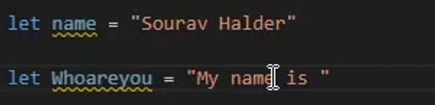

# Convert String to Literals

## Overview
The Convert String to Literals extension provides functionality to convert regular strings to template strings within a specified set of languages in Visual Studio Code. This extension allows for more efficient and convenient string manipulation by leveraging the power of template strings.

## Settings

| Name                                      | Description                                                              | Default Value                                                    |
| ----------------------------------------- | ------------------------------------------------------------------------ | ---------------------------------------------------------------- |
| `template-string-converter.enable`        | Enable the extension on/off                                            | `true`                                                           |
| `template-string-converter.validLanguages` | Languages the extension should apply to                                  | `typescript, javascript, vue`                                               |
                                                       |

You can modify these settings in the VS Code settings to customize the behavior of the Template String Converter extension according to your requirements.

## License
This extension is licensed under the [MIT License](https://opensource.org/licenses/MIT).

